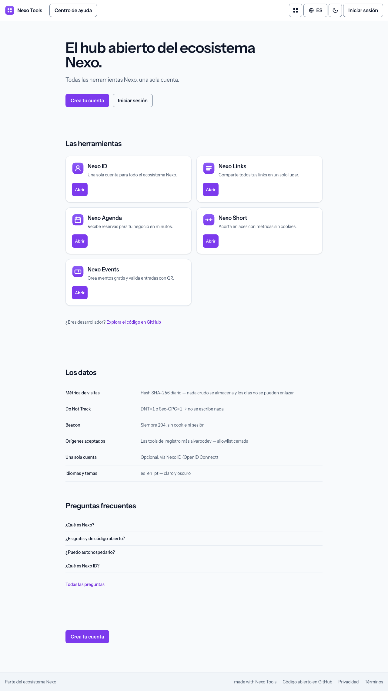
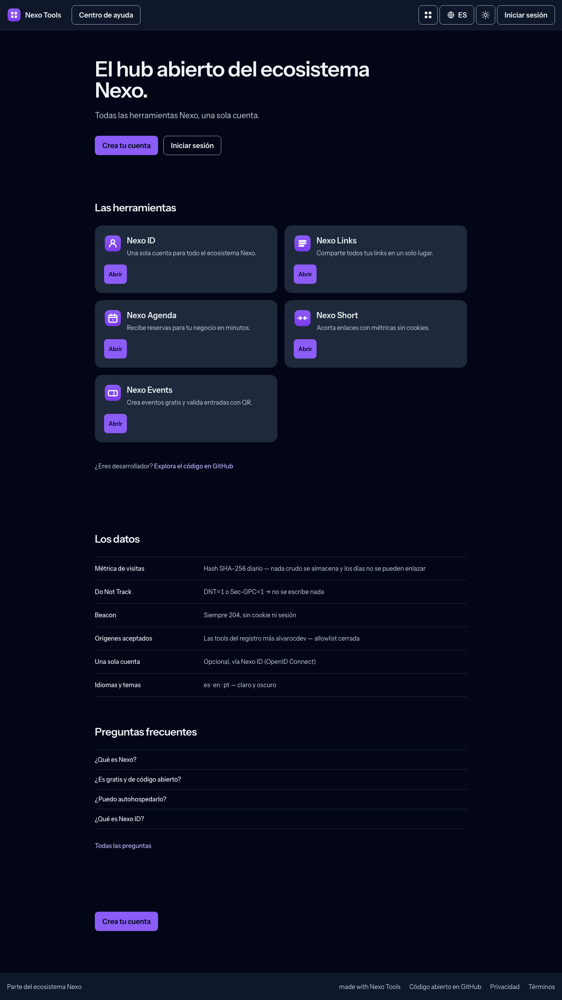

# Nexo Tools

**One home for the whole Nexo ecosystem — discover every tool, hop between them with one account, and watch the family from a single cookieless dashboard.**
Self-hosted, no lock-in, no trackers.

[**Live demo**](https://nexotools.alvarocdev.com) ·
[Deployment](DEPLOYMENT.md) ·
[Docs](docs/) ·
[Scope](docs/SCOPE.md)

---

Nexo Tools is the **hub of the Nexo family**: a self-hosted homepage that presents
every tool, explains what each one does, and gets people into them in one click. It
also carries the ecosystem's shared identity — the app-switcher woven into every
sibling tool, an optional shared account ([Nexo ID](https://github.com/nexo-tools/nexo-id)
SSO) with a personal *"your tools"* springboard, and a cookieless dashboard that
watches the whole family. It doubles as the **reference implementation** of the Nexo
brand and chrome that every other tool mirrors.

## Why Nexo Tools?

- **One front door** — the landing page lists every tool with a one-line pitch and a
  direct link, so a non-technical visitor can find and open the right one without
  reading a repo.
- **Move between tools anywhere** — the shared app-switcher (part of the Nexo chrome
  every sibling ships) lets people jump from one tool to another from any page.
- **One optional account** — sign in with Nexo ID and get a personal *"your tools"*
  springboard: mark the tools you use, launch them, and curate your own shortcuts.
  Turn SSO off and the hub runs perfectly standalone — the account layer simply
  disappears.
- **Cookieless ecosystem analytics** — a tiny beacon records visits with **no cookies,
  no raw IPs, and no cross-site tracking**; it honours Do Not Track, and visitor
  hashes rotate daily. No consent banner needed.
- **One dashboard for the whole family** — `/admin` aggregates the beacon into total
  visits, daily unique visitors and a per-tool breakdown — reading only your own
  database, never an external service.
- **Admin gated by identity** — the dashboard is locked to an allowlist of Nexo ID
  accounts; with no allowlist configured there is **no admin surface at all**.
- **The brand reference** — canonical Nexo look and chrome (violet tokens, automatic
  light/dark, shared footer, translatable `/help` center) that the sibling tools copy
  to stay visually consistent.
- **Multilingual** — English, Spanish and Portuguese (`en`/`es`/`pt`) with a visible
  switcher, and theme and language that follow you across every tool.
- **Fast, private, portable** — server-rendered, system fonts, **zero external
  requests** (no CDNs, no font services, no trackers), and self-hostable on your own
  domain.

## Screenshots

Captured from a local instance seeded with `DemoSeeder`, by
`node ~/alvaro/scripts/nexo-shots.mjs .` — never from production.

| Light | Dark |
| --- | --- |
|  |  |

See it for real at the [live demo](https://nexotools.alvarocdev.com).

## Tech stack

PHP 8.3+ · Laravel 13 · Blade + Alpine.js + Tailwind CSS (Vite) · MySQL

Quality: [Pest](https://pestphp.com) · [Pint](https://laravel.com/docs/pint) ·
[Larastan](https://github.com/larastan/larastan) · GitHub Actions CI.
Zero external runtime requests — no CDNs, no Google Fonts, system font stack.

## Self-hosting

A standard Laravel app: PHP 8.3+, MySQL, and anything from cheap shared hosting to a
VPS. Multi-instance by design — run your own hub on your own domain, pointing the
registry at your own tools.

**[DEPLOYMENT.md](DEPLOYMENT.md)** has the real steps: running it locally, the
environment reference (attribution, SSO, admin allowlist, beacon) and the production
deploy. The tool registry behind the landing, the app-switcher and the beacon
allowlist lives in [`config/nexo-ecosystem.php`](config/nexo-ecosystem.php).

## Nexo ecosystem

Nexo is a family of open-source, self-hostable tools that share one visual identity,
one optional account ([Nexo ID](https://github.com/nexo-tools/nexo-id) SSO) and one set of
engineering standards. Every tool runs **fully standalone** — the ecosystem is opt-in.

| Tool | What it is | Live | Repo |
| --- | --- | --- | --- |
| **Nexo Tools** | Ecosystem hub — discover the tools and hop between them with one account | [nexotools.alvarocdev.com](https://nexotools.alvarocdev.com) | — you are here |
| **Nexo ID** | One account for every tool — OAuth 2.0 / OIDC SSO | [nexoid.alvarocdev.com](https://nexoid.alvarocdev.com) | [nexo-id](https://github.com/nexo-tools/nexo-id) |
| **Nexo Links** | Link-in-bio you host yourself (Linktree alternative) | [nexolinks.alvarocdev.com](https://nexolinks.alvarocdev.com) | [nexo-links](https://github.com/nexo-tools/nexo-links) |
| **Nexo Agenda** | Bookings for service businesses (Fresha / Booksy alternative) | [nexoagenda.alvarocdev.com](https://nexoagenda.alvarocdev.com) | [nexo-agenda](https://github.com/nexo-tools/nexo-agenda) |
| **Nexo Short** | URL shortener with private, cookieless stats | [nexoshort.alvarocdev.com](https://nexoshort.alvarocdev.com) | [nexo-short](https://github.com/nexo-tools/nexo-short) |
| **Nexo Events** | Event tickets, passes and QR check-in | [nexoevents.alvarocdev.com](https://nexoevents.alvarocdev.com) | [nexo-events](https://github.com/nexo-tools/nexo-events) |

New to Nexo? Start at **[nexotools.alvarocdev.com](https://nexotools.alvarocdev.com)**.
Built by **[alvarocdev.com](https://alvarocdev.com)** — the tech behind Nexo.

## License

[MIT](LICENSE) © [Alvaro Carrizales](https://alvarocdev.com) — the tech behind Nexo.

---

Status: **live** at [nexotools.alvarocdev.com](https://nexotools.alvarocdev.com), with the
account layer (Nexo ID SSO, *your tools*, `/admin` metrics) and the shared brand and chrome
the sibling tools copy from.
